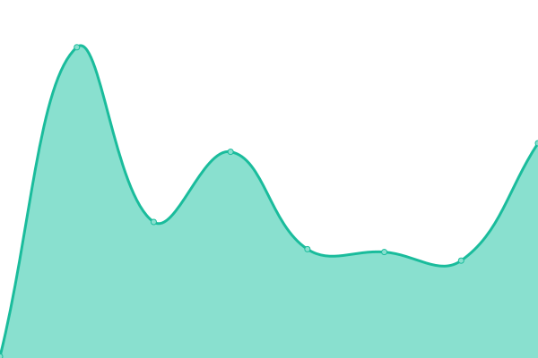
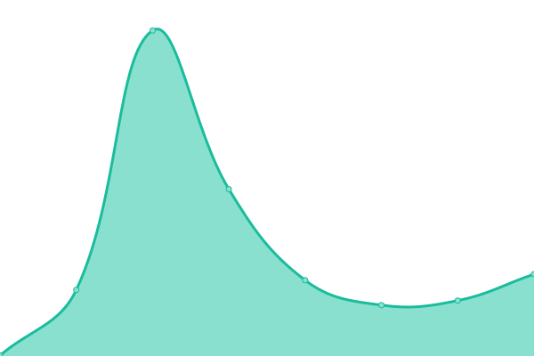
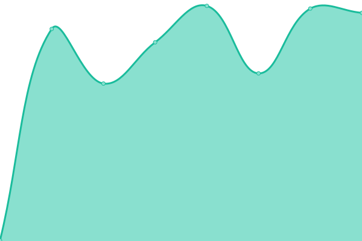
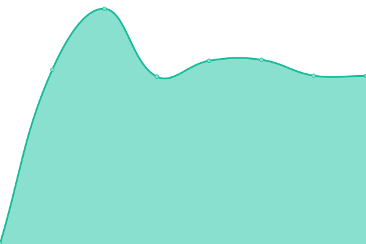

# [📈 Live Status](https://status.andreijiroh.xyz): <!--live status--> **🟩 All systems operational**

This repository contains the open-source uptime monitor and status page for [community.andreijiroh.dev - expanded personal namespace for Andrei Jiroh](https://andreijiroh.xyz), powered by [Upptime](https://github.com/upptime/upptime).

With [Upptime](https://upptime.js.org), you can get your own unlimited and free uptime monitor and status page, powered entirely by a GitHub repository. We use [Issues](https://github.com/andreijiroh-dev/infra-status/issues) as incident reports, [Actions](https://github.com/andreijiroh-dev/infra-status/actions) as uptime monitors, and [Pages](https://status.andreijiroh.xyz) for the status page.

<!--start: status pages-->
<!-- This summary is generated by Upptime (https://github.com/upptime/upptime) -->
<!-- Do not edit this manually, your changes will be overwritten -->
<!-- prettier-ignore -->
| URL | Status | History | Response Time | Uptime |
| --- | ------ | ------- | ------------- | ------ |
|  [Homepage](https://andreijiroh.xyz) | 🟩 Up | [homepage.yml](https://github.com/andreijiroh-dev/infra-status/commits/HEAD/history/homepage.yml) | 

 194ms
     
 | 

<a href="https://status.andreijiroh.dev/history/homepage">100.00%</a>
    

|  [Digital Garden](https://garden.andreijiroh.xyz) | 🟩 Up | [digital-garden.yml](https://github.com/andreijiroh-dev/infra-status/commits/HEAD/history/digital-garden.yml) | 

 344ms
     
 | 

<a href="https://status.andreijiroh.dev/history/digital-garden">100.00%</a>
    

|  [golinks](https://go.andreijiroh.xyz/api/ping) | 🟩 Up | [golinks.yml](https://github.com/andreijiroh-dev/infra-status/commits/HEAD/history/golinks.yml) | 

 261ms
     
 | 

<a href="https://status.andreijiroh.dev/history/golinks">100.00%</a>
    

|  [Blog (hosted on Nest)](https://blog.andreijiroh.dev) | 🟩 Up | [blog-hosted-on-nest.yml](https://github.com/andreijiroh-dev/infra-status/commits/HEAD/history/blog-hosted-on-nest.yml) | 

 784ms
     
 | 

<a href="https://status.andreijiroh.dev/history/blog-hosted-on-nest">13.37%</a>
    

<!--end: status pages-->

[**Visit our status website →**](https://status.andreijiroh.xyz)

## 📄 License

- Powered by: [Upptime](https://github.com/upptime/upptime)
- Code: [MIT](./LICENSE) © [Anand Chowdhary](https://anandchowdhary.com), supported by [Pabio](https://pabio.com)
- Data in the `./history` directory: [Open Database License](https://opendatacommons.org/licenses/odbl/1-0/)
