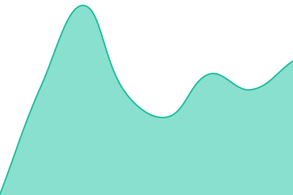
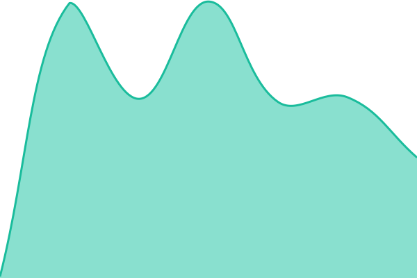

# [📈 Live Status](https://status.andreijiroh.xyz): <!--live status--> **🟧 Partial outage**

This repository contains the open-source uptime monitor and status page for [community.andreijiroh.dev - expanded personal namespace for Andrei Jiroh](https://andreijiroh.xyz), powered by [Upptime](https://github.com/upptime/upptime).

With [Upptime](https://upptime.js.org), you can get your own unlimited and free uptime monitor and status page, powered entirely by a GitHub repository. We use [Issues](https://github.com/andreijiroh-dev/infra-status/issues) as incident reports, [Actions](https://github.com/andreijiroh-dev/infra-status/actions) as uptime monitors, and [Pages](https://status.andreijiroh.xyz) for the status page.

<!--start: status pages-->
<!-- This summary is generated by Upptime (https://github.com/upptime/upptime) -->
<!-- Do not edit this manually, your changes will be overwritten -->
<!-- prettier-ignore -->
| URL | Status | History | Response Time | Uptime |
| --- | ------ | ------- | ------------- | ------ |
|  [Homepage](https://andreijiroh.dev) | 🟩 Up | [site.yml](https://github.com/andreijiroh-dev/infra-status/commits/HEAD/history/site.yml) | 

 117ms
     
 | 

<a href="https://status.andreijiroh.dev/history/site">100.00%</a>
    

|  [Personal API](https://api.andreijiroh.dev/ping) | 🟥 Down | [api.yml](https://github.com/andreijiroh-dev/infra-status/commits/HEAD/history/api.yml) | 

 776ms
     
 | 

<a href="https://status.andreijiroh.dev/history/api">99.61%</a>
    

|  [Digital Garden / Personal Wiki](https://wiki.andreijiroh.dev) | 🟩 Up | [garden.yml](https://github.com/andreijiroh-dev/infra-status/commits/HEAD/history/garden.yml) | 

 111ms
     
 | 

<a href="https://status.andreijiroh.dev/history/garden">100.00%</a>
    

|  [Blog (hosted on Nest)](https://blog.andreijiroh.dev) | 🟥 Down | [blog.yml](https://github.com/andreijiroh-dev/infra-status/commits/HEAD/history/blog.yml) | 

 0ms
     
 | 

<a href="https://status.andreijiroh.dev/history/blog">0.00%</a>
    

|  [GitBook docs (on docs site w/o custom domain/subdirectory)](https://gitbook.andreijiroh.dev) | 🟩 Up | [gitbook.yml](https://github.com/andreijiroh-dev/infra-status/commits/HEAD/history/gitbook.yml) | 

 443ms
     
 | 

<a href="https://status.andreijiroh.dev/history/gitbook">100.00%</a>
    

|  [Nextcloud on Coolify Homelab](https://nextcloud.andreijiroh.dev) | 🟥 Down | [nextcloud.yml](https://github.com/andreijiroh-dev/infra-status/commits/HEAD/history/nextcloud.yml) | 

 37ms
     
 | 

<a href="https://status.andreijiroh.dev/history/nextcloud">0.00%</a>
    

|  [Coolify Homelab Server](https://coolify.andreijiroh.dev) | 🟥 Down | [coolify.yml](https://github.com/andreijiroh-dev/infra-status/commits/HEAD/history/coolify.yml) | 

 36ms
     
 | 

<a href="https://status.andreijiroh.dev/history/coolify">0.00%</a>
    

<!--end: status pages-->

[**Visit our status website →**](https://status.andreijiroh.xyz)

## 📄 License

- Powered by: [Upptime](https://github.com/upptime/upptime)
- Code: [MIT](./LICENSE) © [Anand Chowdhary](https://anandchowdhary.com), supported by [Pabio](https://pabio.com)
- Data in the `./history` directory: [Open Database License](https://opendatacommons.org/licenses/odbl/1-0/)
